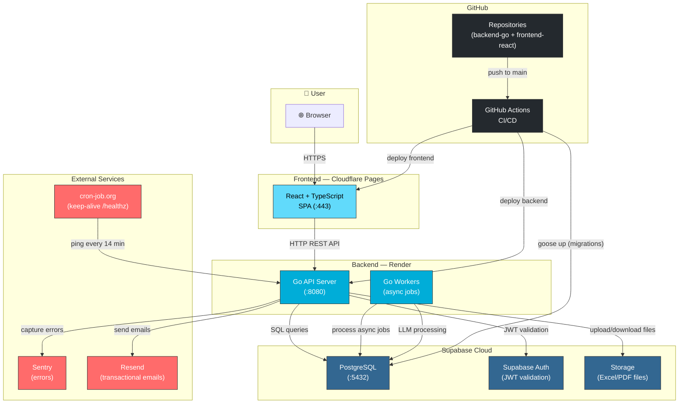
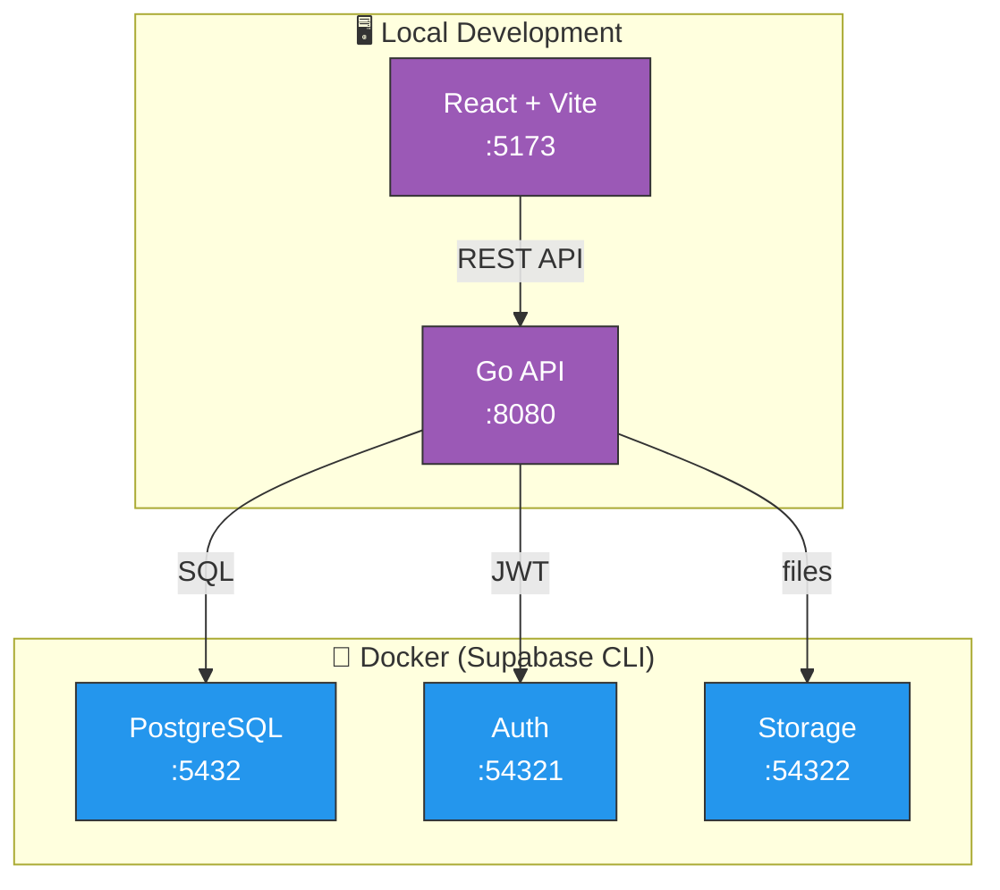

# Deployment Diagram — Parity

> A visual representation of how the system components are connected in production and on-premises development.

## Production (Cloud)

## Local development — Supabase CLI

## Key

| Component | Service | Function |
| --- | --- | --- |
| **Cloudflare Pages** | Frontend hosting | Serves the React SPA, global CDN |
| **Render** | Backend hosting | Runs the Go API + asynchronous workers |
| **Supabase Cloud** | DB + Auth + Storage | PostgreSQL, JWT authentication, files |
| **Sentry** | Error tracking | Captures and reports backend errors |
| **Resend** | Transactional email | Welcome emails, notifications |
| **cron-job.org** | Keep-alive | Pings `/healthz` every 14 minutes (free plan) |
| **GitHub Actions** | CI/CD | Tests + automatic deployment upon merging to `main` |
