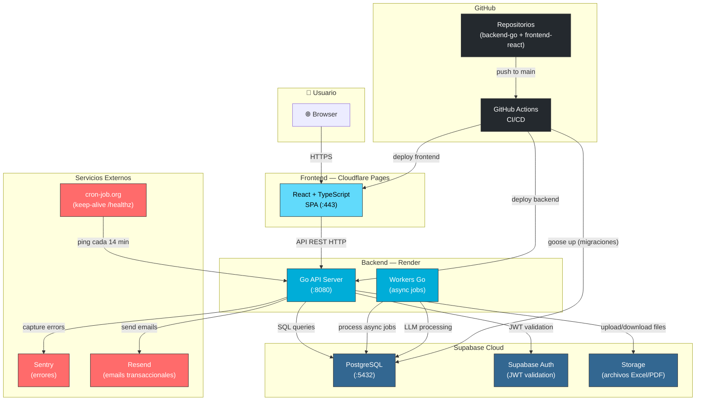
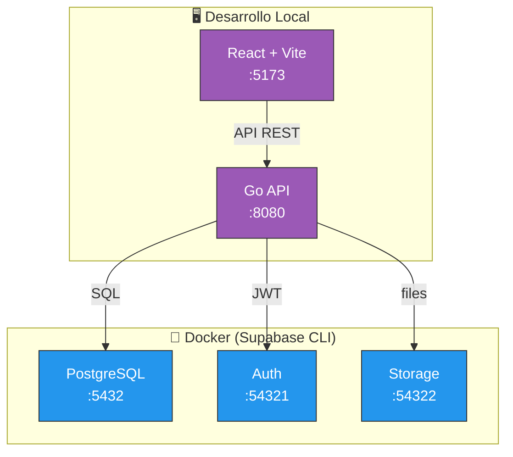

# Diagrama de Despliegue — Parity

> Visualización de cómo se conectan los componentes del sistema en producción y desarrollo local.

## Producción (Nube)

## Desarrollo Local — Supabase CLI

## Leyenda

| Componente | Servicio | Función |
| --- | --- | --- |
| **Cloudflare Pages** | Frontend hosting | Sirve la SPA React, CDN global |
| **Render** | Backend hosting | Ejecuta la API Go + workers async |
| **Supabase Cloud** | DB + Auth + Storage | PostgreSQL, autenticación JWT, archivos |
| **Sentry** | Error tracking | Captura y reporta errores del backend |
| **Resend** | Email transaccional | Emails de bienvenida, notificaciones |
| **cron-job.org** | Keep-alive | Ping `/healthz` cada 14 min (proyecto free) |
| **GitHub Actions** | CI/CD | Tests + deploy automático al mergear a main |
