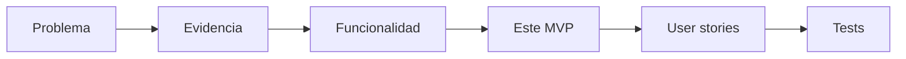

# Definición de MVP — Parity

> Documento público. Qué debe cumplir el MVP, qué hipótesis valida y qué riesgos asume.

## 1. Enunciado del MVP

Probar que una orden heterogénea (Excel/PDF/texto) se convierte en planilla validada contra el catálogo con matching exacto+barcode, cliente mapeado y ambigüedad señalada — reduciendo el tiempo de decenas de minutos hacia 2 min — **sin reemplazar el criterio humano**.

## 2. Núcleo vs. stretch vs. fuera

- **Núcleo (compromiso):** detección de cliente + matching exacto/barcode + import/export + detección de ambigüedad.
- **Stretch (si alcanza el tiempo):** texto libre (requiere pipeline LLM propio), cantidades por cliente, conversión de unidades, catálogo visible.
- **Fuera:** OCR sobre fotos borrosas.

## 3. Hipótesis que el MVP debe validar

| # | Hipótesis | Cómo se mide |
|---|---|---|
| H1 | El matching exacto+barcode resuelve la mayor frustración (duplicados) | % líneas auto-matcheadas sin intervención |
| H2 | Detectar ambigüedad (sin resolver) es suficiente y confiable | % ambigüedades detectadas vs. falsos negativos |
| H3 | El tiempo por orden baja a menos de 5 min (meta 2) | Medición con usuario operativo |
| H4 | El operador mantiene control y confía (no siente reemplazo) | Test cualitativo post-uso |

## 4. Riesgos del MVP y mitigación

- **Riesgo de alcance:** mitigado con regla de caída (texto libre/ambigüedad → v2).
- **Tabla de conversión de unidades no confirmada:** no bloquea el núcleo.
- **Dependencia de calidad de entrada:** flujo alternativo "pedir reenvío".
- **Pipeline LLM (PDF):** costo/latencia por orden y privacidad a evaluar en spike.

## 5. Trazabilidad

