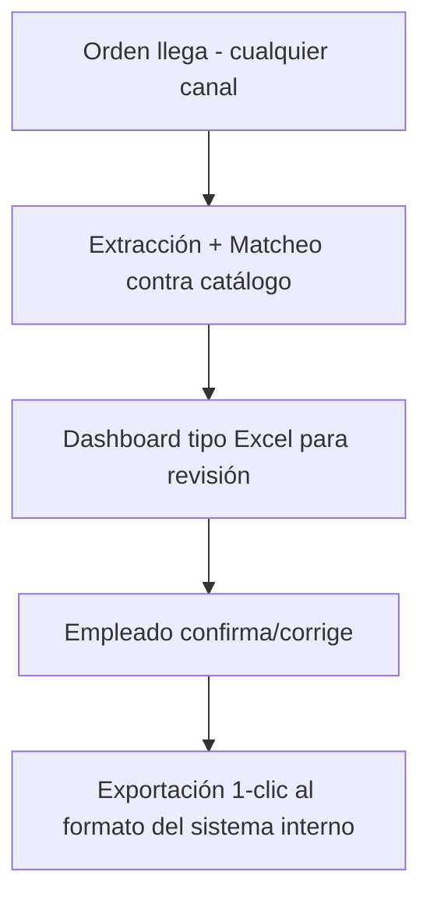

# Definición de Producto — Parity

> Documento público. Qué es el producto, para quién y cómo funciona, en lenguaje universal.

## 1. Qué es

**Parity** (producto como persona) / **parity** (software) es el estandarizador de órdenes de compra: recibe la orden tal como la envía el cliente, la interpreta automáticamente contra el catálogo interno y la deja lista en un dashboard tipo Excel para revisión humana en segundos, no en decenas de minutos.

## 2. Para quién

- **Usuario primario:** el empleado administrativo que carga pedidos (una porción significativa de su jornada se va en validación; meta: bajar de ~30 min a 2 min por orden).
- **Comprador:** la distribuidora como organización (licencia).
- **No-usuarios que condicionan el producto:** los clientes que envían las órdenes en su propio formato.

## 3. Qué hace (flujo TO-BE)

- **Matcheo:** 1) código exacto, 2) fallback por código de barras (hasta 3 EAN por producto), 3) detección de ambigüedad por descripción (marca, no resuelve).
- **Mapeo cliente:** tabla razón social / CUIT / sucursal → código cliente interno (sin esto no se puede exportar).
- **Trazabilidad:** cada fila exportada guarda cómo se matcheó (código exacto / barra / manual).

## 4. Ciclo de vida del usuario

1. **Registro:** auto-registro con rol base de operador; el administrador promueve a admin.
2. **Operación diaria:** subir orden → revisar grilla → corregir lo marcado → exportar en un clic.
3. **Administración (admin):** catálogo, clientes/mapeos y órdenes.

## 5. Procesamiento de una orden

* **Excel:** extracción directa de columnas/filas → matching → dashboard.
* **PDF con tablas:** extracción por librería + LLM en paralelo → el JSON del LLM completa/corrige → matching. Todas las filas de origen LLM nacen en `revisar`.
* **PDF de texto:** flujo de librería normal.
* **Regla de estados:** `ok` solo si idéntico a catálogo; cualquier retoque → `revisar`; dato inválido → `error`; dato ausente → `faltante`.
* **Grilla editable:** agregar/quitar filas, edición manual y dropdown de descripción con buscador que recalcula el código (si elige otro producto cambia el código, si es el mismo se mantiene).

## 6. Principios no negociables

1. **La tecnología asiste, la persona decide.** Nunca auto-facturar; exportar es explícito.
2. **Señalar, no ocultar.** Todo match dudoso se marca (ok / revisar / error / faltante) con alternativa visible y celda editable.
3. **No desplazar del sistema habitual.** Grilla tipo Excel, exportación al formato interno.
4. **Estandarizar antes de sofisticar.** Primero formato único validado; reglas por cliente en v2.

## 7. Módulos

| Módulo | Qué cubre |
|---|---|
| Órdenes | Upload, parsing Excel, validación, persistencia cabecera+líneas |
| Matching | Normalización + matcheo exacto/ambiguo/fallido |
| Catálogo | Artículos del catálogo interno hacia tabla consultable |
| API | Contratos REST `/api/v1`, errores `{code,message}` |
| Frontend | Upload, grilla de revisión, edición manual, estados |

## 8. Métricas de éxito

- Tiempo por orden: decenas de minutos → menos de 5 (meta 2).
- % de líneas matcheadas automáticamente sin intervención.
- % de ambigüedades detectadas vs. falsos negativos.
- Reducción de errores de facturación por código/cantidad equivocada.
