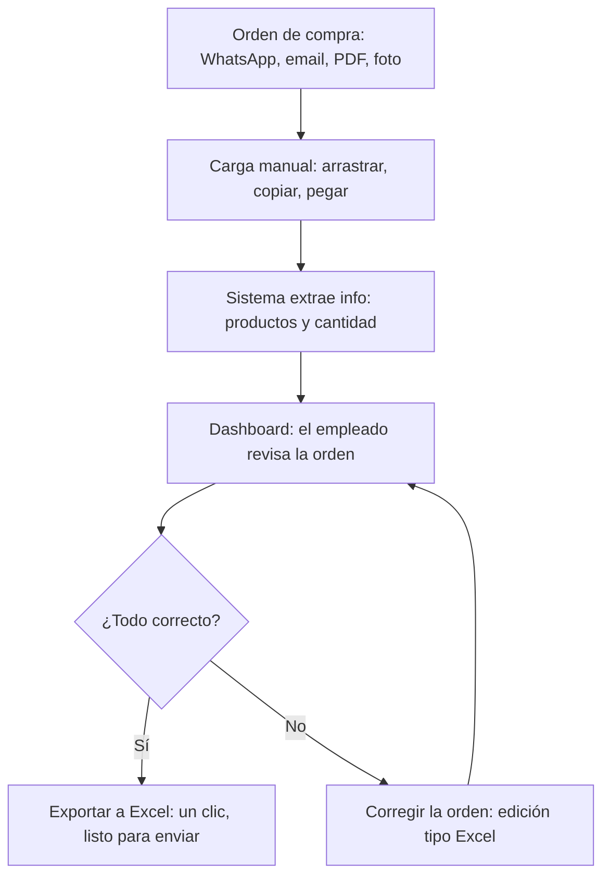
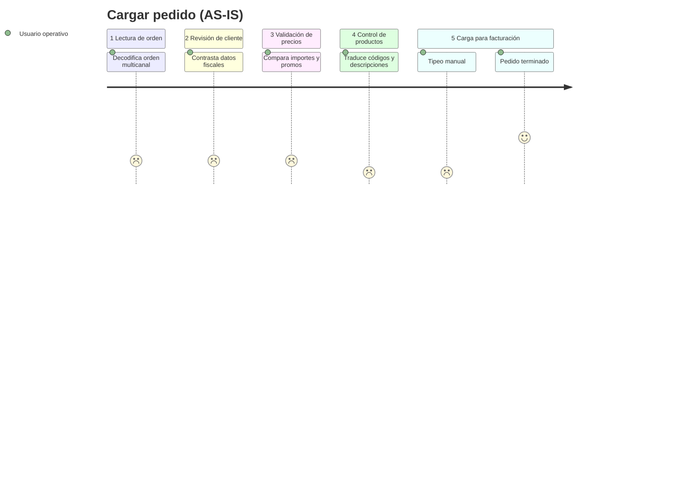

# User Flows — Parity

> Flujo de la plataforma para el empleado (8 nodos): cómo una orden entra al sistema, es procesada, revisada en dashboard y exportada o corregida. Todos los flujos mantienen el principio “La tecnología asiste, la persona decide”.

## 1. Flujo principal — Estandarizar orden para el empleado (happy path)

**Diagrama fuente:** `flujo_estandarizador_para_empleado.svg` / `.png` — Título: “Flujo de la plataforma para el empleado” — Desc: “Cómo una orden entra al sistema, es procesada, revisada en dashboard y exportada a Excel o corregida si tiene errores.”

```
[Orden de compra: WhatsApp, email, PDF, foto]
        └─► [Carga manual: arrastrar, copiar, pegar]
                        │
                        ▼
          [Sistema extrae info: identifica productos y cantidad]
                        │
                        ▼
          [Dashboard: el empleado revisa la orden]
                        │
                        ▼
               ◇ ¿Todo correcto? ◇
                 /            \
              No (→)        Sí (→)
               /                \
[Corregir la orden: edición  [Exportar a Excel: un clic,
 tipo Excel]  ── vuelve a     listo para enviar]
 revisión
```



**Pasos detallados:**

| # | Nodo SVG | Acción usuario | Sistema | Salida |
|---|---|---|---|---|
| 1 | Orden de compra | — | — | Input heterogéneo (cualquier canal) |
| 2 | Carga manual | Drag&drop / copy-paste / upload | — | Única vía de entrada en MVP (sin bot ni ingesta automática, ADR-019) |
| 3 | Sistema extrae | — | Parser + matching: 1) código exacto 2) barcode (3 columnas EAN) 3) mapeo cliente CUIT→código 4) detección ambigüedad (marca, no resuelve) | Grilla precargada con 4 estados |
| 4 | Dashboard | Revisa grilla tipo Excel (ver `design-system.md` columnas `Código|Código Proveedor|Descripción|Unidades|Display|U.Compra`) | Resalta dudas ámbar `#D5A129`, ok verde `#03F07C` | Decisión |
| 5 | ¿Todo correcto? | Sí → Exportar / No → Corregir | — | — |
| 6a | Exportar a Excel | 1 clic | Genera `OC_*.xlsx` formato interno + log de validaciones | Listo para enviar/facturar |
| 6b | Corregir | Edita celdas inline, elige alternativa sugerida | Revalida | Vuelve a 4 |

## 2. Flujos alternos / edge

| Caso | Flujo | Estado actual MVP |
|---|---|---|
| **Foto borrosa** | Entrada → Extrae falla OCR → Dashboard marca “ilegible — pedir reenvío legible” → salida manual | **Fuera de MVP** por viabilidad baja. No se invierte en OCR en v1; se mantiene proceso actual “pedir reenvío”. |
| **Código cliente no viene** | Extrae CUIT/razón social → busca en tabla mapeo → si no existe → badge ámbar “cliente no mapeado” → empleado selecciona código de lista | **Dentro MVP** (prerrequisito). Sin esto no se puede exportar. |
| **Duplicado por packaging** | Cliente manda código viejo → sistema busca EAN en 3 columnas → encuentra código vigente → badge verde “match por barra” + tooltip “código viejo → nuevo” | **Dentro MVP** (núcleo, mayor frustración operativa) |
| **Unidad no coincide / Cantidad multi-formato** | Sistema importa `Unidades/Display/U.Compra` tal cual → si equivalencia conocida, sugiere conversión; si no, deja tal cual + nota | **Fuera MVP / v2** — se resuelve caso por caso por cliente |
| **Descripción ambigua** | Descripción genérica (“alfajor guaymallén”) → match múltiple → estado “revisar: 3 candidatos” → empleado elige | **Dentro MVP como detección, no resolución automática** |
| **Precios/condiciones desactualizadas** | Compara `Costo U.` vs. maestro promociones → alerta | v2 (requiere maestro promociones) |

## 3. Estados de la grilla (para `design-system.md` y `prototype.md`)

- **ok** (verde `#03F07C`) — extraído idéntico a catálogo, sin tocar nada
- **revisar** (ámbar `#D5A129`, fondo `#FFF9EC`) — requiere cualquier retoque o es de origen LLM — editable
- **error** (rojo `color-error`) — dato presente pero inválido (código inexistente, cantidad vacía, EAN no encontrado)
- **faltante** (gris) — dato ausente en origen

## 4. Reglas de negocio transversales

- **Nunca auto-facturar:** exportar es explícito, no automático.
- **Trazabilidad:** cada fila exportada guarda log “match por: código exacto | barra | manual” para auditoría futura.


## 6. Recorrido del usuario (AS-IS)



## 7. Referencias

- **AS-IS 5 etapas:** Lectura → Revisión de cliente → Validación precios → Control productos → Carga
- **TO-BE:** este flujo colapsa las 5 etapas manuales en recepción → extracción/matcheo → revisión → confirmación → exportación.
- **Correspondencia con alcance** (`02-product/scope.md`): flujo principal = mapeo cliente + matching + import/export + detección ambigüedad; foto borrosa fuera; unidad/cantidad y texto libre en stretch.

---
*Próximo: wireframes de Dashboard (grilla, badges, edición inline, export) en `prototype.md`.*
