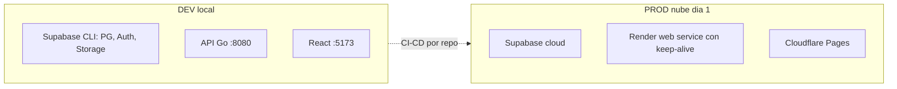
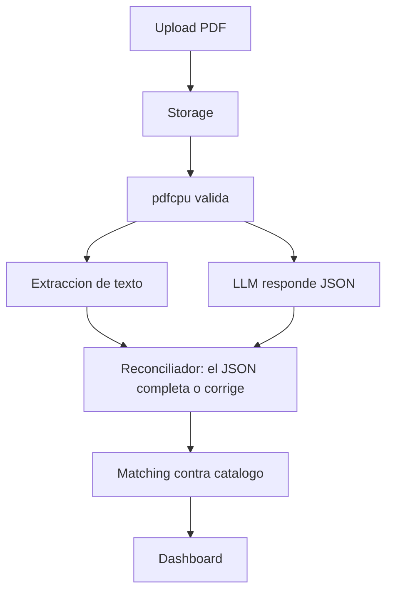
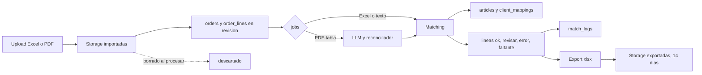

# Arquitectura — Parity

> Basada en `architecture-decisions.md` (ADRs 001–019) + `api-design.md`.
> **Fecha:** 2026-09-11.

## Topología

Repos separados: backend Go + migraciones · frontend React + TypeScript.
CI/CD: GitHub Actions por repo (test + deploy en main).

## Flujo PDF

## Infraestructura y transversales

- **Tipo:** monolito modular + capas (ADR-012).
- **CORS** restringido al origen Pages (ADR-013).
- **Trabajos async:** tabla `jobs` en PG + workers Go en el mismo binario (sin Redis/Rabbit, ADR-014). El dashboard consulta estado del job ("validando con IA…").
- **Retención:** import se borra al procesar; export 14 días vía `pg_cron` nocturno; SQL siempre (ADR-015). `/healthz` toca PG para mantener vivo el proyecto free.
- **Registro:** auto-registro Supabase (default `empleado`, admin promueve) + SMTP Resend bienvenida (ADR-016).
- **Errores:** Sentry en Go (ADR-017). Grafana → v2.
- **Secrets:** env vars Render (ADR-018). Sin staging: local + prod.

## Ciclo de vida del dato

## Decisiones diferidas (no bloquean construcción inicial)

Proveedor LLM + timeout/fallback, tope PDF, ordenamiento candidatos — ver ADRs y spikes pendientes.
