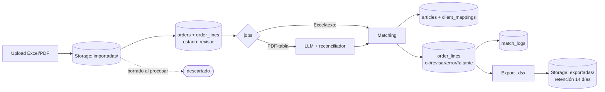

# Arquitectura — Parity

> Basada en `architecture-decisions.md` (ADRs 001–019) + `api-design.md`.
> **Fecha:** 2026-09-11.

## Topología

```
 DEV local (docker-compose)                    PROD (nube día 1, $0)
 ┌─ Supabase CLI (PG+Auth+Storage, Docker)      ┌─ Supabase cloud (PG+Storage+Auth)
 ├─ API Go (go run :8080)                        ├─ Render web service Free (Go :8080) + UptimeRobot (ping c/15min)
 └─ React (npm run dev :5173)                    └─ Cloudflare Pages (dashboard + landing)
 Repos separados: parity-api (Go+Goose) · parity-web (React+TS)
 CI/CD: GitHub Actions por repo (test + deploy en main, incluye `goose up`)
```

## Backend Go (`parity-api`)

```
cmd/server/            bootstrap (Gin router + handler stdlib archivos)
internal/http/         handlers Gin, DTOs, middleware auth (JWKS→rol)
internal/ordenes/      service/model/repository (órdenes + líneas)
internal/matching/     normalización, exacto, barcode, candidatos trigrama, estados
internal/catalogo/     importer idempotente por codigo, repository
internal/parser/       excel (excelize) · pdf (pdfcpu + texto) · reconciliador PDF+LLM
internal/llm/          interfaz LLMExtractor (proveedor por spike) — solo PDF-tabla
internal/clientes/     mapeos CUIT→código (prerrequisito de exportación)
migrations/            Goose · testdata/ fixtures (nunca datos reales de producción)
```

Flujo PDF (ADR-009): upload stdlib → Storage → pdfcpu valida → extracción texto + LLM en paralelo → reconciliador (tabla→JSON LLM, texto→librería; filas LLM nacen `revisar`) → matching → dashboard.

## Frontend React (`parity-web`)

`supabase-js` (login/sesión) → Bearer a `/api/v1` → grilla editable (agregar/quitar/editar líneas, dropdown descripción con buscador que recalcula código) → export 1 clic. Sin lógica de matching en cliente. Deploy en Cloudflare Pages (`VITE_API_URL` por ambiente).

## Infraestructura y transversales

- **Tipo:** monolito modular + capas (ADR-012).
- **CORS** restringido al origen Pages (ADR-013).
- **Trabajos async:** tabla `jobs` en PG + workers Go en el mismo binario (sin Redis/Rabbit, ADR-014). El dashboard consulta estado del job ("validando con IA…").
- **Retención:** import se borra al procesar; export 14 días vía `pg_cron` nocturno; SQL siempre (ADR-015). `/healthz` toca PG para mantener vivo el proyecto free.
- **Registro:** auto-registro Supabase (default `empleado`, admin promueve) + SMTP Resend bienvenida (ADR-016).
- **Errores:** Sentry en Go (ADR-017). Grafana → v2.
- **Secrets:** env vars Render (ADR-018). Sin staging: local + prod.

## Ciclo de vida del dato



## Decisiones diferidas (no bloquean construcción inicial)

Proveedor LLM + timeout/fallback, tope PDF, ordenamiento candidatos — ver ADRs y spikes pendientes.
