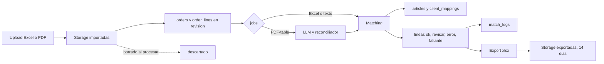

# Modelo de Datos — Parity (PostgreSQL + Supabase)

> Modelo físico en PostgreSQL + Supabase.
> Migraciones versionadas. Extensión requerida: `pg_trgm` (similitud de texto).
> **Fecha:** 2026-09-11.

## Tablas

```sql
-- Espejo mínimo del usuario Supabase (el login vive en auth.users)
profiles(id uuid PK → auth.users, email text, rol text DEFAULT 'empleado' CHECK (rol IN ('admin','empleado')), nombre text);

client_mappings(id serial PK, razon_social text, cuit text, sucursal text, direccion text,
  codigo_cliente text NOT NULL UNIQUE, created_by uuid → profiles);

articles(codigo text PK, codigo_proveedor text, descrip text NOT NULL, linea text,
  codbarra text, codbarra2 text, codbarra3 text, unidad_base text);

orders(id serial PK, client_mapping_id → client_mappings NULL (NULL = "no mapeado"),
  canal text CHECK (canal IN ('excel','pdf','manual')), archivo_url text, estado text,
  created_by uuid → profiles, created_at timestamptz);

order_lines(id serial PK, order_id → orders ON DELETE CASCADE,
  codigo text, codigo_proveedor text, descrip text, proveedor text,
  unidades numeric, display numeric, u_compra numeric, costo_u numeric, total numeric,
  estado text CHECK (estado IN ('ok','revisar','error','faltante')) DEFAULT 'revisar',
  match_por text CHECK (match_por IN ('exacto','barra','manual','llm')) NULL,
  articulo_codigo text → articles NULL);

match_logs(id serial PK, order_line_id → order_lines, regla text,
  antes jsonb, despues jsonb, usuario uuid → profiles, created_at timestamptz);

jobs(id serial PK, order_id → orders ON DELETE CASCADE,
  estado text CHECK (estado IN ('pendiente','procesando','listo','fallido')) DEFAULT 'pendiente',
  error text NULL, created_at timestamptz, updated_at timestamptz);
```

## Índices (matching)

- `articles(codigo)`, `articles(codbarra, codbarra2, codbarra3)` — búsqueda exacta y por barras.
- `CREATE INDEX ON articles USING gin (descrip gin_trgm_ops)` — candidatos por texto aproximado + trigramas.
- `client_mappings(cuit, razon_social)` — resolución de cliente.
- `order_lines(order_id)` — grilla por orden.

## Seguridad a nivel BD

- RLS activada como **segunda capa**: políticas por rol desde el token; el backend opera con llave de servicio y enforza roles en middleware (primera capa).
- Archivos en Supabase Storage: buckets `ordenes/importadas/` (efímero, se borra al procesar) + `ordenes/exportadas/` (14 días vía `pg_cron`); registros SQL siempre. Límite Excel 10MB; tope PDF a definir (spike).

## Notas

- `estado DEFAULT 'revisar'`: nada es `ok` hasta verificación exacta.
- `match_por='llm'` implica `estado='revisar'` (regla de aplicación).
- Ordenamiento de candidatos y top-N: calibra el equipo (placeholder, no bloquea).

## Ciclo de vida del dato


