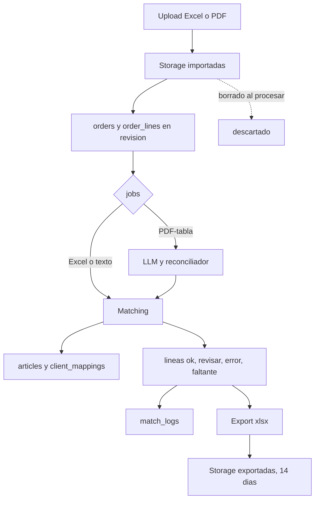

# Modelo de Datos — Parity (PostgreSQL + Supabase)

> Modelo físico en PostgreSQL + Supabase.
> Migraciones versionadas. Extensión requerida: `pg_trgm` (similitud de texto).
> **Fecha:** 2026-09-11.

## Índices (matching)

- `articles(codigo)`, `articles(codbarra, codbarra2, codbarra3)` — búsqueda exacta y por barras.
- `CREATE INDEX ON articles USING gin (descrip gin_trgm_ops)` — candidatos por texto aproximado + trigramas.
- `client_mappings(cuit, razon_social)` — resolución de cliente.
- `order_lines(order_id)` — grilla por orden.

## Seguridad a nivel BD

- RLS activada como **segunda capa**: políticas por rol desde el token; el backend opera con llave de servicio y refuerza roles en middleware (primera capa).
- Archivos en Supabase Storage: buckets `ordenes/importadas/` (efímero, se borra al procesar) + `ordenes/exportadas/` (14 días vía `pg_cron`); registros SQL siempre. Límite Excel 10MB; tope PDF a definir (spike).

## Notas

- `estado DEFAULT 'revisar'`: nada es `ok` hasta verificación exacta.
- `match_por='llm'` implica `estado='revisar'` (regla de aplicación).
- Ordenamiento de candidatos y top-N: calibra el equipo (placeholder, no bloquea).

## Ciclo de vida del dato

