# Cómo trabajamos (agentes)

> La construcción de Parity se apoya en un equipo de agentes de IA especializados, coordinados por un orquestador y supervisados por personas en cada paso importante.

%% Flujo completo de la arquitectura — Parity
%% Basado en: arquitectura_agentes_skills_workflows_proyecto.md
%% Simplificación: el Human Gate (seccion 4) aplica en TODAS las transiciones,
%% acá se marcan solo los puntos más críticos para no saturar el diagrama.

```mermaid
flowchart TD

    subgraph SG0["Entrada y Ruteo (sección 3)"]
        U["Persona escribe una solicitud<br/>en lenguaje natural"]
        ORCH{"Orchestrator<br/>interpreta el mensaje"}
        AMBIG{"¿Ambiguo entre<br/>2+ workflows?"}
        ASK["Pregunta al usuario<br/>cuál corresponde"]
    end

    subgraph SG1["Modo Plan obligatorio (sección 5)"]
        PLAN["Documento de implementación<br/>(qué / qué no / archivos / riesgos)"]
        GATE0[["🔒 Human Gate<br/>¿Aprobado?"]]
    end

    subgraph SG2["8.1 — Nueva Funcionalidad"]
        IDEA["Idea / Necesidad"]
        AN["Análisis"]
        NEC{"¿Es necesaria?"}
        DESCARTADO["Se descarta"]
        REQ["Product/BA Agent<br/>Requisito"]
        US["Product/BA Agent<br/>User Story"]
        AC["Product/BA Agent<br/>Acceptance Criteria"]
        UX["UX/UI Agent<br/>Flujo y wireframes"]
        RFD["Ready for Development"]
    end

    subgraph SG3["8.2 — Desarrollo de la User Story"]
        BE["Backend Agent<br/>API + lógica"]
        FE["Frontend Agent<br/>Interfaz"]
        BRANCH["Branch propia<br/>(nunca directo en main)"]
        TESTDB[("Base de datos<br/>de prueba/fixture")]
        BUGCHECK{"¿Aparece un bug<br/>no relacionado?"}
        BUGWF["Dispara Workflow de Bug (8.4)<br/>anidado — escala al usuario antes"]
    end

    subgraph SG4["Calidad"]
        QA["QA Agent<br/>Tests"]
        CR["Code Reviewer Agent"]
    end

    subgraph SG5["8.3 — Pull Request"]
        CI["CI: Tests + Build +<br/>Lint + Security checks"]
        APPROVED{"¿Aprobado?"}
        FIXES["Fixes"]
    end

    subgraph SG6["Merge y Release (8.6)"]
        SYNC["Actualizar la branch con<br/>lo último de main antes de mergear"]
        GATEM[["🔒 Human Gate<br/>confirmar merge"]]
        MERGE["Merge a main"]
        REL["Deploy staging → Smoke tests<br/>→ Production → Monitoring"]
        FEEDBACK["Feedback"]
    end

    subgraph SG7["Fuera del pipeline (sección 6.10)"]
        TUTOR["👨‍🏫 Tutor / Mentor Técnico Senior<br/>Consulta directa, en cualquier momento<br/>No decide, no ejecuta, solo explica"]
    end

    MCP[("MCPs externos<br/>ej. GitHub Projects")]

    U --> ORCH
    ORCH --> AMBIG
    AMBIG -->|Sí| ASK --> ORCH
    AMBIG -->|No| PLAN
    ORCH -.->|si la tarea lo requiere| MCP

    PLAN --> GATE0
    GATE0 -->|No| PLAN
    GATE0 -->|Sí| IDEA

    IDEA --> AN --> NEC
    NEC -->|No| DESCARTADO
    NEC -->|Sí| REQ --> US --> AC --> UX --> RFD

    RFD --> BE
    RFD --> FE
    BE --> BRANCH
    FE --> BRANCH
    BRANCH -.-> TESTDB
    BRANCH --> BUGCHECK
    BUGCHECK -->|Sí| BUGWF --> BRANCH
    BUGCHECK -->|No| QA

    QA --> CR --> CI --> APPROVED
    APPROVED -->|No| FIXES --> BRANCH
    APPROVED -->|Sí| SYNC --> GATEM
    GATEM -->|Sí| MERGE --> REL --> FEEDBACK
    FEEDBACK -.->|nuevo ciclo| IDEA

    classDef gate fill:#ffe0e0,stroke:#c0392b,stroke-width:2px,color:#000
    classDef decision fill:#fff4cc,stroke:#d4a017,color:#000
    classDef tutor fill:#f0f0f0,stroke:#888888,stroke-width:2px,stroke-dasharray: 5 5,color:#000
    classDef mcp fill:#e8e0f5,stroke:#8e44ad,color:#000

    class GATE0,GATEM gate
    class AMBIG,NEC,BUGCHECK,APPROVED decision
    class TUTOR tutor
    class MCP mcp
```

Cómo leerlo: toda solicitud entra en lenguaje natural y se rutea (preguntando si es ambigua); nada se construye sin plan aprobado; cada especialidad (producto, UX, backend, frontend, QA) tiene su agente; ninguna transición sensible avanza sin aprobación humana; y existe un canal de mentoría directa fuera del pipeline que solo explica, sin decidir ni ejecutar.
