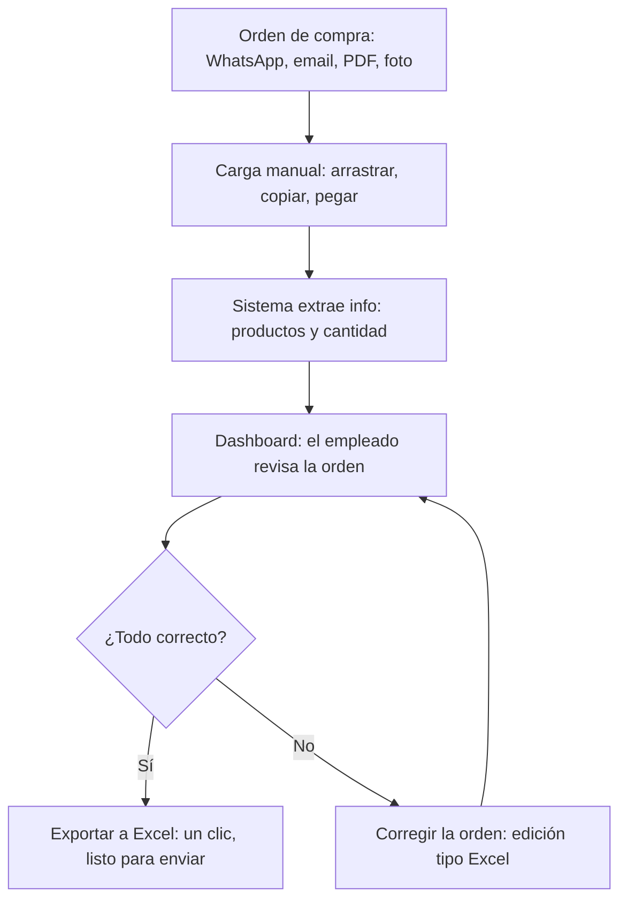
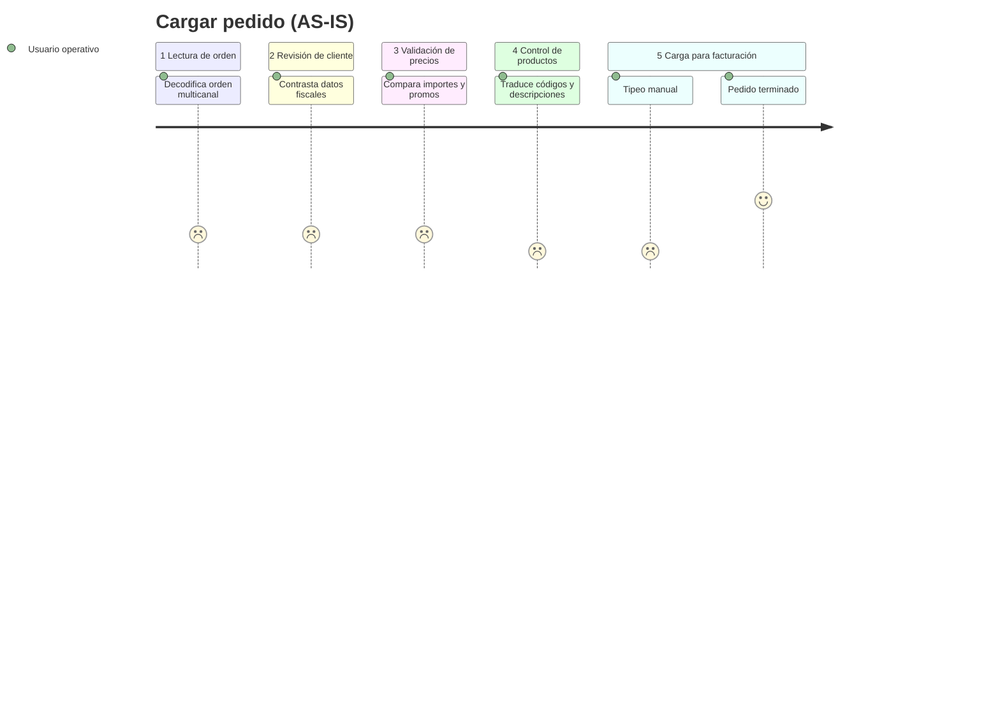
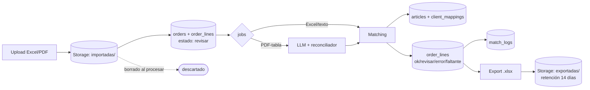
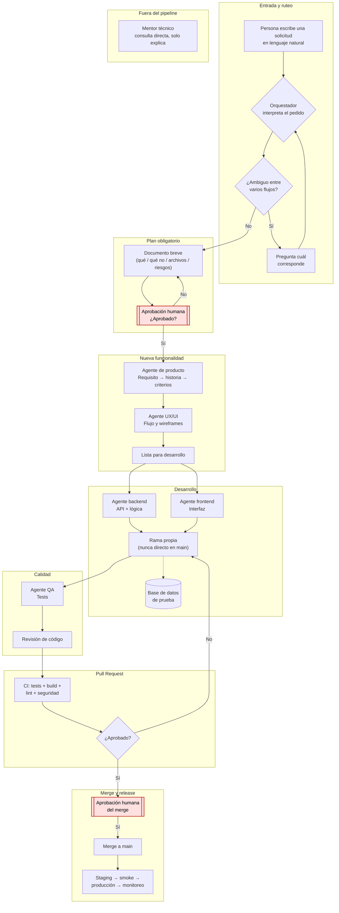

# Parity — Documentación

> Documentación operativa y de producto de la plataforma Parity y su infraestructura de apoyo.

# Parity — Documentación

Parity es un estandarizador de órdenes de compra para distribuidoras: recibe el pedido tal como lo envía cada cliente (Excel, PDF, foto, texto), lo interpreta automáticamente contra el catálogo interno y lo deja listo en un dashboard tipo planilla para revisión humana en segundos. Combina una aplicación web, un backend (API) y un pipeline de extracción con asistencia de LLM para los casos difíciles.

Esta documentación está escrita para lectores de producto, operaciones e ingeniería. Explica qué intenta lograr Parity, cómo funcionan los flujos centrales del negocio y cómo el sistema técnico los soporta.

<CardGroup cols={2}>
  <Card title="Lógica de producto" icon="notebook-text" href="#overview">
    Qué problema resuelve Parity y cómo funciona el ciclo central del producto.
  </Card>

  <Card title="Estado del proyecto" icon="list-checks" href="#etapa-actual-del-producto">
    Qué existe hoy, qué es parte del MVP y qué queda fuera.
  </Card>

  <Card title="API" icon="braces" href="#technical">
    Visión general de la API, autenticación y modelo de datos.
  </Card>

  <Card title="Operaciones" icon="activity" href="#operations">
    Cómo conviven frontend, API, base de datos y observabilidad.
  </Card>
</CardGroup>

## Lo que hace Parity

Parity ayuda a distribuidoras a:

* Recibir órdenes en cualquier formato (Excel, PDF, texto) sin re-tipeo manual.
* Identificar al cliente automáticamente (razón social / CUIT → código interno).
* Matchear cada línea contra el catálogo (código exacto o código de barras).
* Detectar ambigüedades y marcarlas para revisión humana, sin adivinar.
* Corregir en una grilla editable y exportar en un clic al formato del sistema interno.

## Componentes principales del sistema

| Componente | Propósito |
|---|---|
| App web | Cliente para registro, login, subida de órdenes y dashboard de revisión. |
| API | Backend de negocio y fuente de verdad para órdenes, catálogo y validaciones. |
| PostgreSQL | Fuente durable de verdad para datos del producto. |
| Storage | Guarda archivos importados y exportados con política de retención. |
| Auth gestionado | Registro, login y tokens JWT sin auth casero. |
| Pipeline PDF + LLM | Extrae y estructura pedidos en PDF antes del matching. |
| Sentry | Captura de errores y caídas en producción. |

## Mapa de documentación

* **Resumen general** explica la lógica de producto, el estado actual y la forma del sistema.
* **Producto** explica el ciclo de vida del usuario y el procesamiento de órdenes.
* **Diseño** explica principios UX/UI, dashboard y sistema visual.
* **Técnico** explica plataforma, pipeline PDF, APIs, auth y datos.
* **Operaciones** explica despliegue, infraestructura, observabilidad y runbooks.
* **Cómo trabajamos** explica el proceso de desarrollo con agentes y aprobaciones humanas.

## Etapa actual del producto

Parity está en fase fundacional de MVP. La arquitectura es intencionalmente simple: un monolito modular para la API más una SPA, con servicios gestionados para base de datos, auth y hosting. El objetivo es validar el ciclo central (orden entra → pedido validado sale) antes de introducir infraestructura más pesada.

## Overview

### Lógica de negocio

Cada cliente envía su pedido a su manera: distintos formatos, códigos propios y descripciones libres. Traducirlo a mano consume de 20 a 30 minutos por orden y suma errores. Parity invierte el proceso: el sistema extrae, matchea y pre-valida; la persona solo revisa lo dudoso y confirma.

Principios no negociables: la tecnología asiste, la persona decide; lo dudoso se señala, nunca se oculta; no se reemplaza el sistema habitual (grilla tipo Excel, exportación al formato interno).

### Conceptos centrales

| Concepto | Qué significa en Parity |
|---|---|
| **Orden de compra** | Documento del cliente con productos y cantidades, en cualquier formato. |
| **Código interno** | Identificador único del producto en el catálogo; es el que exige el sistema de importación. |
| **Código de barras** | Hasta 3 EAN por producto; resuelve duplicados por cambio de packaging. |
| **Mapeo de cliente** | Tabla razón social / CUIT / sucursal → código interno. Sin mapeo no se exporta. |
| **Matching** | 1) código exacto, 2) código de barras, 3) detección de ambigüedad por descripción. |
| **Ambigüedad** | Descripción genérica con varios candidatos: se muestra para elegir, no se adivina. |
| **Estados de línea** | `ok` (idéntico a catálogo) · `revisar` (requiere ojo humano) · `error` (dato inválido) · `faltante` (dato ausente). |

### Arquitectura del sistema

Monolito modular + capas (Handler → Service → Repository) en Go, con SPA en React + TypeScript. Módulos del backend: órdenes, matching, catálogo, clientes, parser (Excel/PDF), pipeline LLM y trabajos async con workers en el mismo proceso. Repositorios separados para backend y frontend, con contratos de API congelados. El frontend consume la API en origen distinto con CORS restringido; CI/CD por repo con tests y deploy en `main`.

### Estado del proyecto

**Núcleo MVP:** detección de cliente, matching por código exacto y barras, importación/exportación de documentos, detección (no resolución) de ambigüedad.
**Stretch:** texto libre, conversión de unidades, cantidades por cliente.
**Fuera:** OCR sobre fotos ilegibles (con salida digna: pedir reenvío legible).

## Product

### Ciclo de vida del usuario

1. **Registro:** auto-registro con rol base de operador; el administrador promueve a admin.
2. **Operación diaria:** subir orden → revisar grilla → corregir lo marcado → exportar en un clic.
3. **Administración (admin):** catálogo, clientes/mapeos y órdenes.

### Procesamiento de una orden

* **Excel:** extracción directa de columnas/filas → matching → dashboard.
* **PDF con tablas:** extracción por librería + LLM en paralelo → el JSON del LLM completa/corrige → matching. Todas las filas de origen LLM nacen en `revisar`.
* **PDF de texto:** flujo de librería normal.
* Regla de estados: `ok` solo si idéntico a catálogo; cualquier retoque → `revisar`.
* La grilla es editable: agregar/quitar filas, edición manual y dropdown de descripción con buscador que recalcula el código.

## Diseño (UX/UI)

### Principios

1. La tecnología asiste, la persona decide (nunca se adivina, se señala).
2. Todo lo dudoso se marca con alternativa visible y celda editable.
3. No se desplaza al usuario de su herramienta: grilla tipo Excel y exportación al formato interno.
4. Tono claro, directo y cercano; nada que suene a reemplazo del criterio humano.

### Dashboard

Grilla con columnas de orden + estado por fila (`ok` verde / `revisar` ámbar / `error` / `faltante`), dropdown de descripción con buscador en vivo, edición inline y exportación en un clic. Las filas de origen LLM nacen siempre en `revisar`.

### Sistema visual

* **Primario:** `#03F07C` (CTAs, éxito) · **Secundario:** `#5DE9AA` · **Fondo cálido:** `#FFF9EC` · **Alerta:** `#D5A129` · **Tinta:** `#000000`, con modo claro/oscuro adaptativo.
* **Logo dual:** versión letras negras (fondos claros) y blancas (fondos oscuros).
* **Pendiente de dirección visual:** tipografía final de UI, HEX de error/info/borde y área de seguridad del logo.

## Technical

### parity (el backend)

API REST en Go (`/api/v1`, JSON, errores `{code, mensaje}`). Rutas CRUD y matching en framework web; transferencia de archivos en handler de streaming dedicado. Nunca auto-factura: exportar es explícito.

### Pipeline PDF + LLM

`pdfcpu` valida y prepara el PDF, extracción de texto por librería y estructuración por LLM corren en paralelo; un reconciliador toma el JSON para completar lo que la librería no detectó. Interfaz desacoplada del proveedor de LLM. Trabajos async en tabla de jobs con workers en el mismo proceso (estados pendiente/procesando/listo/fallido, consultables por el dashboard).

### Data model

Tablas: perfiles/roles, mapeos de cliente, artículos, órdenes, líneas (con estado y origen del match), logs de validación, jobs. Búsqueda exacta + trigramas para candidatos; RLS como segunda capa de seguridad.

### API overview

Subida de órdenes, consulta de orden con estados y candidatos, edición/agregado/borrado de líneas, exportación Excel, búsqueda de catálogo (con buscador para el dropdown), mapeos de cliente, estado de jobs, health check.

### Authentication

Auth gestionado externo: la app obtiene sesión y envía el token Bearer; la API lo valida y autoriza por rol (`admin` | operador). Login, refresh y recupero viven en el proveedor, no en el backend.

## Operations

### Deployment

Desarrollo 100% local (base, API y Auth en contenedores + app en dev) y producción en nube: frontend (dashboard + landing) en hosting estático con CDN, API en servicio web contenerizado, PostgreSQL + Storage + Auth gestionados. CI/CD por repositorio (tests + deploy en `main`, migraciones versionadas). Sin staging: local + prod. CORS restringido al origen del frontend; secrets por ambiente en variables del servicio.

### Infraestructura

| Pieza | Rol |
|---|---|
| Hosting estático | Dashboard y landing con CDN |
| Servicio web | API Go (plan con keep-alive) |
| Postgres gestionado | Datos + jobs + logs |
| Storage | Importados (efímeros) y exportados (14 días) |
| Auth gestionado | Registro, login, JWT, SMTP de bienvenida |
| Sentry | Errores y panics en producción |
| UptimeRobot | Keep-alive del backend + monitoreo de disponibilidad |

### Observabilidad

Errores y caídas vía Sentry; disponibilidad vía UptimeRobot (ping periódico que además mantiene vivo el servicio); health check con chequeo de base; métricas de plataforma. Dashboards de métricas propios: v2.

### Variables de entorno

Mapa de alto nivel (nombres, nunca valores): conexión a base (`DATABASE_URL`), claves del proveedor Auth, clave del proveedor LLM, DSN de Sentry, URL pública de la API para el frontend.

### Runbooks

* **Archivo ilegible:** responder "ilegible — pedir reenvío legible", no reintentar.
* **Cliente no mapeado:** bloquear exportación, badge ámbar, el admin crea el mapeo.
* **Mismatch LLM vs librería:** las filas LLM ya nacen en `revisar`; el operador decide.
* **Job fallido:** reintentar desde el dashboard; si persiste, escalar con el log.
* **Retención:** el importado se borra al procesar; el exportado vive 14 días; los registros SQL se conservan siempre (auditoría).

## Cómo trabajamos (agentes)

La construcción de Parity se apoya en un equipo de agentes de IA especializados, coordinados por un orquestador y supervisados por personas en cada paso importante.

Cómo leerlo: toda solicitud entra en lenguaje natural y se rutea (preguntando si es ambiguo); nada se construye sin plan aprobado; cada especialidad (producto, UX, backend, frontend, QA) tiene su agente; ninguna transición sensible avanza sin aprobación humana; y existe un canal de mentoría directa fuera del pipeline que solo explica, sin decidir ni ejecutar.
