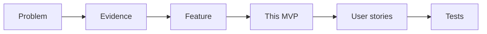

# MVP Definition — Parity

> Public document. What the MVP must satisfy, which hypotheses it validates and which risks it takes.

## 1. MVP statement

Prove that a heterogeneous order (Excel/PDF/text) becomes a catalog-validated spreadsheet with exact+barcode matching, mapped customer and flagged ambiguity — cutting time from tens of minutes toward 2 min — **without replacing human judgment**.

## 2. Core vs. stretch vs. out

- **Core (committed):** customer detection + exact/barcode matching + import/export + ambiguity detection.
- **Stretch (if time allows):** free text (needs its own LLM pipeline), per-customer quantities, unit conversion, visible catalog.
- **Out:** OCR on blurry photos.

## 3. Hypotheses the MVP must validate

| # | Hypothesis | How it's measured |
|---|---|---|
| H1 | Exact+barcode matching solves the top frustration (duplicates) | % of lines auto-matched with no intervention |
| H2 | Detecting ambiguity (without resolving) is sufficient and reliable | % of ambiguities detected vs. missed |
| H3 | Time per order drops under 5 min (target 2) | Measured with an operating user |
| H4 | The operator keeps control and trusts it (no replacement feeling) | Post-use qualitative test |

## 4. MVP risks and mitigations

- **Scope risk:** mitigated with a drop rule (free text/ambiguity → v2).
- **Unconfirmed unit-conversion table:** doesn't block the core.
- **Input-quality dependency:** "ask for resend" fallback flow.
- **LLM pipeline (PDF):** per-order cost/latency and privacy to evaluate in spike.

## 5. Traceability

