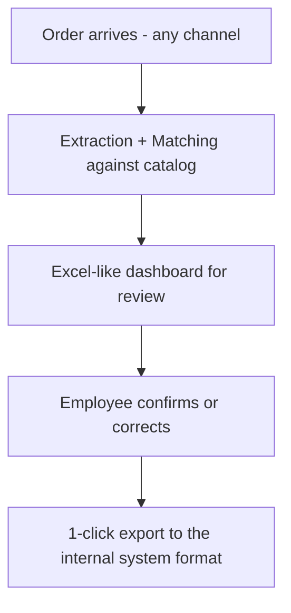

# Product Definition — Parity

> Public document. What the product is, who it's for and how it works, in universal language.

## 1. What it is

**Parity** (the product as a persona) / **parity** (the software) is the purchase-order standardizer: it receives the order exactly as the customer sends it, interprets it automatically against the internal catalog, and leaves it ready on an Excel-like dashboard for human review in seconds, not tens of minutes.

## 2. Who it's for

- **Primary user:** the admin employee who loads orders (a significant share of their day goes to validation; goal: from ~30 min down to 2 min per order).
- **Buyer:** the distributor as an organization (license).
- **Non-users shaping the product:** the customers who send orders in their own format.

## 3. What it does (TO-BE flow)

- **Matching:** 1) exact code, 2) barcode fallback (up to 3 EANs per product), 3) description-ambiguity detection (flags, doesn't resolve).
- **Customer mapping:** business name / tax ID / branch → internal customer code table (no export without it).
- **Traceability:** every exported row records how it was matched (exact code / barcode / manual).

## 4. User lifecycle

1. **Signup:** self-registration with operator base role; admins promote to admin.
2. **Daily operation:** upload order → review grid → fix flagged rows → 1-click export.
3. **Admin (admins):** catalog, customers/mappings and orders.

## 5. How an order is processed

* **Excel:** direct column/row extraction → matching → dashboard.
* **Table PDFs:** library extraction + LLM in parallel → the LLM's JSON completes/corrects → matching. Every LLM-sourced row starts in `revisar`.
* **Text PDFs:** normal library flow.
* **State rule:** `ok` only when identical to catalog; any touch-up → `revisar`; invalid data → `error`; missing data → `faltante`.
* **Editable grid:** add/remove rows, manual editing and description dropdown with live search that recalculates the code (picking another product changes the code, picking the same keeps it).

## 6. Non-negotiable principles

1. **Technology assists, the person decides.** Never auto-invoice; exporting is explicit.
2. **Flag, don't hide.** Every doubtful match is marked (ok / revisar / error / faltante) with visible alternative and editable cell.
3. **Don't displace the usual system.** Excel-like grid, export to the internal format.
4. **Standardize before sophisticating.** Validated single format first; per-customer rules in v2.

## 7. Modules

| Module | Coverage |
|---|---|
| Orders | Upload, Excel parsing, validation, header+line persistence |
| Matching | Normalization + exact/ambiguous/failed matching |
| Catalog | Internal catalog articles into a queryable table |
| API | REST contracts `/api/v1`, `{code,message}` errors |
| Frontend | Upload, review grid, manual editing, states |

## 8. Success metrics

- Time per order: tens of minutes → under 5 (target 2).
- % of lines auto-matched with no intervention.
- % of ambiguities detected vs. missed (false negatives).
- Fewer billing errors from wrong code/quantity.
