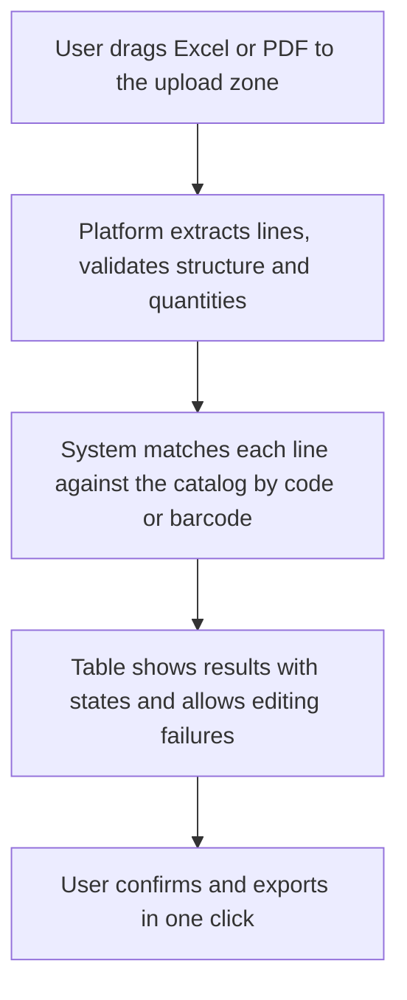
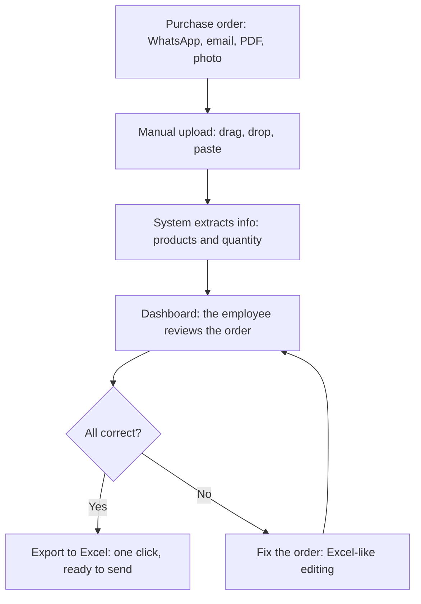
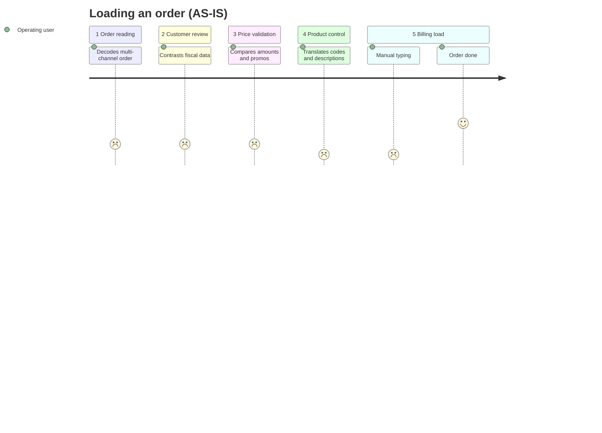

# User Flows — Parity

> The platform flow for the employee (8 nodes): how an order enters the system, gets processed, reviewed on a dashboard and exported or corrected. Every flow keeps the "technology assists, the person decides" principle.

## 1. Main flow — Standardize order for the employee (happy path)

Full 8-node flow detail:

**Detailed steps:**

| # | Node | User action | System | Output |
|---|---|---|---|---|
| 1 | Purchase order | — | — | Heterogeneous input (any channel) |
| 2 | Manual upload | Drag&drop / copy-paste / upload | — | Only entry point in MVP (no bot, no automatic intake) |
| 3 | System extracts | — | Parser + matching: exact code, barcode (3 EAN columns), customer mapping, ambiguity detection (flags, doesn't resolve) | Grid preloaded with 4 states |
| 4 | Dashboard | Reviews Excel-like grid | Highlights doubts in amber, ok in green | Decision |
| 5 | All correct? | Yes → Export / No → Fix | — | — |
| 6a | Export to Excel | 1 click | Generates internal format + validation log | Ready to send/bill |
| 6b | Fix | Edits cells inline, picks suggested alternative | Revalidates | Back to 4 |

## 2. Alternate / edge flows

| Case | Flow | MVP status |
|---|---|---|
| **Blurry photo** | Input → OCR extraction fails → Dashboard marks "illegible — ask for legible resend" → manual exit | **Out of MVP** (low viability). No OCR investment in v1; keep current "ask for resend" process. |
| **Missing customer code** | Extracts tax ID/business name → looks up mapping table → if missing → amber badge "unmapped customer" → employee picks code from list | **In MVP** (prerequisite). No export without it. |
| **Packaging duplicate** | Customer sends old code → system searches EAN across 3 columns → finds current code → green "barcode match" badge + "old code → new" tooltip | **In MVP** (core, top operational frustration) |
| **Mismatched unit / multi-format quantity** | System imports `Units/Display/Purchase units` as-is → if known equivalence, suggests conversion; otherwise leaves as-is + note | **Out of MVP / v2** — resolved case by case per customer |
| **Ambiguous description** | Generic description ("guaymallen alfajor") → multiple match → "revisar: 3 candidates" state → employee picks | **In MVP as detection, not automatic resolution** |
| **Outdated prices/terms** | Compares `Unit cost` vs. promo master → alert | v2 (needs promos master) |

## 3. Grid states (for `design-system.md` and `prototype.md`)

- **ok** (green `#03F07C`) — extracted identical to catalog, untouched
- **revisar** (amber `#D5A129`, `#FFF9EC` background) — needs any touch-up or is LLM-sourced — editable
- **error** (red `color-error`) — present but invalid data (unknown code, empty quantity, EAN not found)
- **faltante** (gray) — data missing at the source

## 4. Cross-cutting business rules

- **Never auto-invoice:** exporting is explicit, never automatic.
- **Traceability:** every exported row stores a "matched by: exact code | barcode | manual" log for future auditing.

## 6. User journey (AS-IS)

## 7. References

- **AS-IS 5 stages:** Reading → Customer review → Price validation → Product control → Loading
- **TO-BE:** this flow collapses the 5 manual stages into reception → extraction/matching → review → confirmation → export.
- **Scope mapping** (`02-product/scope.md`): main flow = customer mapping + matching + import/export + ambiguity detection; blurry photo out; unit/quantity and free text in stretch.
