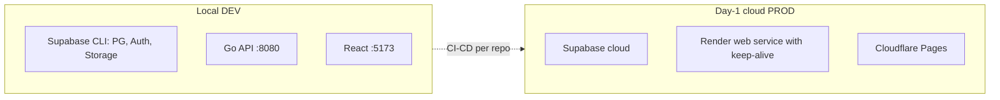
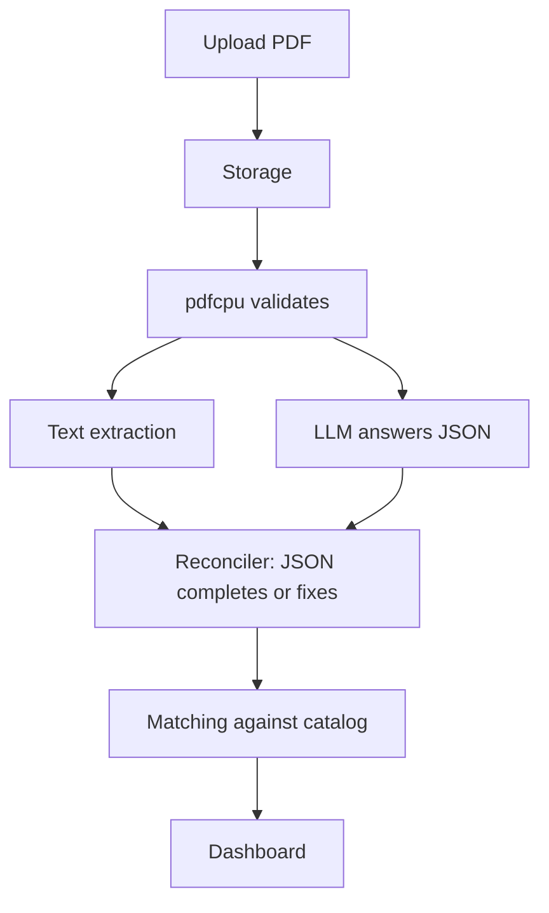
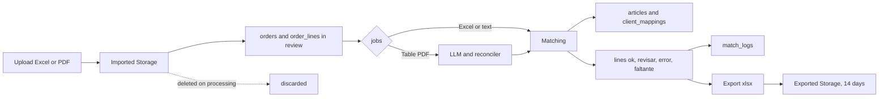

# Architecture — Parity

> Based on `architecture-decisions.md` (19 decisions) + `api-design.md`.
> **Date:** 2026-09-11.

## Topology

Separate repos: Go backend + migrations · React + TypeScript frontend.
CI/CD: GitHub Actions per repo (test + deploy on main).

## PDF flow

## Infrastructure and cross-cutting concerns

- **Type:** modular monolith + layers (decision 12).
- **CORS** restricted to the Pages origin (decision 13).
- **Async jobs:** `jobs` table in PG + Go workers in the same binary (no Redis/Rabbit, decision 14). The dashboard polls job status ("validating with AI…").
- **Retention:** imports deleted on processing; exports 14 days via nightly `pg_cron`; SQL always (decision 15). `/healthz` touches PG to keep the free project alive.
- **Signup:** Supabase self-signup (default `empleado`, admin promotes) + Resend welcome SMTP (decision 16).
- **Errors:** Sentry in Go (decision 17). Grafana → v2.
- **Secrets:** Render env vars (decision 18). No staging: local + prod.

## Data lifecycle

## Deferred decisions (don't block initial build)

LLM provider + timeout/fallback, PDF cap, candidate ordering — see decisions and pending spikes.
