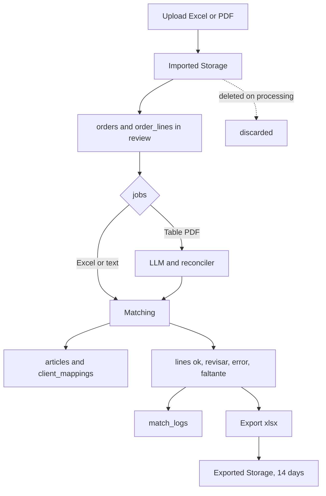

# Data Model — Parity (PostgreSQL + Supabase)

> Physical model in PostgreSQL + Supabase.
> Versioned migrations. Required extension: `pg_trgm` (text similarity).
> **Date:** 2026-09-11.

## Indexes (matching)

- `articles(codigo)`, `articles(codbarra, codbarra2, codbarra3)` — exact and barcode search.
- `CREATE INDEX ON articles USING gin (descrip gin_trgm_ops)` — approximate-text + trigram candidates.
- `client_mappings(cuit, razon_social)` — customer resolution.

## Database-level security

- RLS enabled as **second layer**: role policies from the token; the backend operates with the service key and enforces roles in middleware (first layer).
- Files in Supabase Storage: `ordenes/importadas/` (ephemeral, deleted on processing) + `ordenes/exportadas/` (14 days via `pg_cron`); SQL records always. Excel cap 10MB; PDF cap TBD (spike).

## Notes

- `estado DEFAULT 'revisar'`: nothing is `ok` until exact verification.
- `match_por='llm'` implies `estado='revisar'` (application-level rule).
- Candidate ordering and top-N: team calibrates (placeholder, non-blocking).

## Data lifecycle

