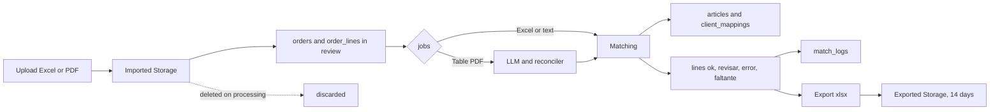

# Data Model — Parity (PostgreSQL + Supabase)

> Physical model in PostgreSQL + Supabase.
> Versioned migrations. Required extension: `pg_trgm` (text similarity).
> **Date:** 2026-09-11.

## Tables

```sql
-- Minimal mirror of the Supabase user (login lives in auth.users)
profiles(id uuid PK → auth.users, email text, rol text DEFAULT 'empleado' CHECK (rol IN ('admin','empleado')), nombre text);

client_mappings(id serial PK, razon_social text, cuit text, sucursal text, direccion text,
  codigo_cliente text NOT NULL UNIQUE, created_by uuid → profiles);

articles(codigo text PK, codigo_proveedor text, descrip text NOT NULL, linea text,
  codbarra text, codbarra2 text, codbarra3 text, unidad_base text);

orders(id serial PK, client_mapping_id → client_mappings NULL (NULL = "unmapped"),
  canal text CHECK (canal IN ('excel','pdf','manual')), archivo_url text, estado text,
  created_by uuid → profiles, created_at timestamptz);

order_lines(id serial PK, order_id → orders ON DELETE CASCADE,
  codigo text, codigo_proveedor text, descrip text, proveedor text,
  unidades numeric, display numeric, u_compra numeric, costo_u numeric, total numeric,
  estado text CHECK (estado IN ('ok','revisar','error','faltante')) DEFAULT 'revisar',
  match_por text CHECK (match_por IN ('exacto','barra','manual','llm')) NULL,
  articulo_codigo text → articles NULL);

match_logs(id serial PK, order_line_id → order_lines, regla text,
  antes jsonb, despues jsonb, usuario uuid → profiles, created_at timestamptz);

jobs(id serial PK, order_id → orders ON DELETE CASCADE,
  estado text CHECK (estado IN ('pendiente','procesando','listo','fallido')) DEFAULT 'pendiente',
  error text NULL, created_at timestamptz, updated_at timestamptz);
```

## Indexes (matching)

- `articles(codigo)`, `articles(codbarra, codbarra2, codbarra3)` — exact and barcode search.
- `CREATE INDEX ON articles USING gin (descrip gin_trgm_ops)` — approximate-text + trigram candidates.
- `client_mappings(cuit, razon_social)` — customer resolution.

## Database-level security

- RLS enabled as **second layer**: role policies from the token; the backend operates with the service key and enforces roles in middleware (first layer).
- Files in Supabase Storage: `ordenes/importadas/` (ephemeral, deleted on processing) + `ordenes/exportadas/` (14 days via `pg_cron`); SQL records always. Excel cap 10MB; PDF cap TBD (spike).

## Notes

- `estado DEFAULT 'revisar'`: nothing is `ok` until exact verification.
- `match_por='llm'` implies `estado='revisar'` (application-level rule).
- Candidate ordering and top-N: team calibrates (placeholder, non-blocking).

## Data lifecycle


