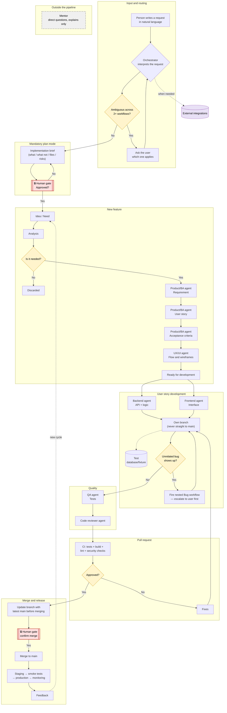

# How We Work (agents)

> How Parity is built: specialized AI agents, coordinated by an orchestrator and supervised by people at every major step.

How to read it: every request enters in natural language and gets routed (asking when ambiguous); nothing is built without an approved plan; each specialty (product, UX, backend, frontend, QA) has its agent; no sensitive transition moves without human approval; and a direct mentoring channel outside the pipeline only explains, never decides or executes.
