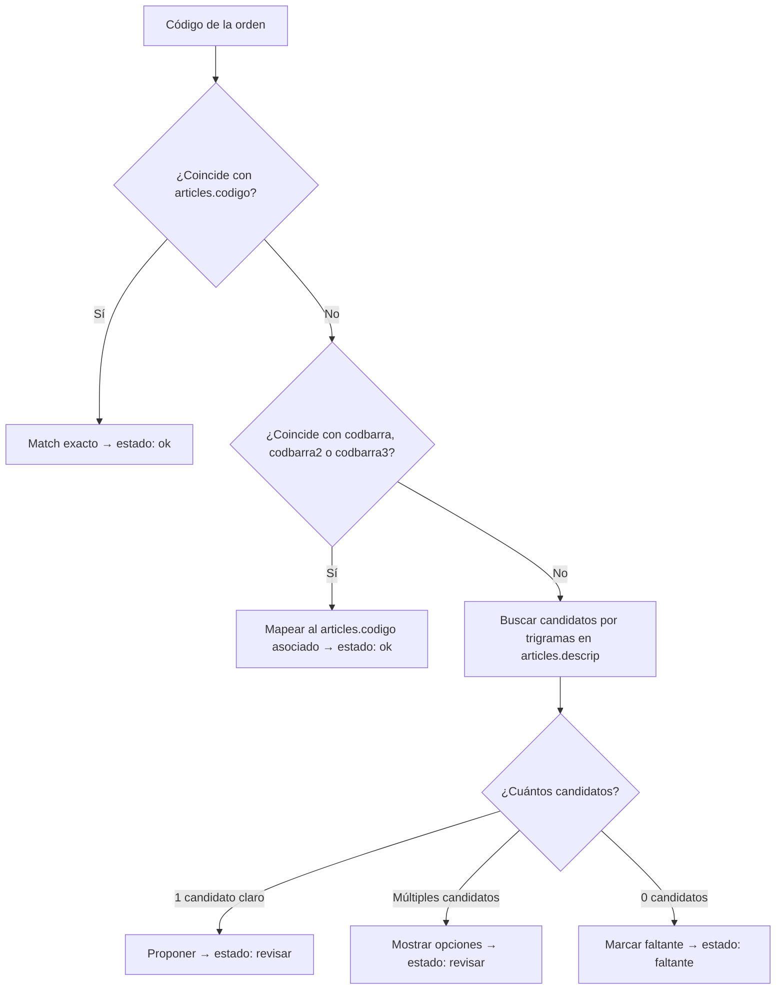

# Catálogo de Productos — Parity

> Estructura del catálogo de artículos que usa Parity para el matching de órdenes. Define los campos, el flujo de matching y las reglas que lo gobiernan.

## Estructura del catálogo (tabla `articles`)

| Campo | Tipo | Descripción | Rol en matching |
| --- | --- | --- | --- |
| `codigo` | PK (string) | **Código interno de la empresa** — la fuente de verdad | Match exacto primario |
| `codigo_proveedor` | string | Código del proveedor | Referencia, no se usa en matching |
| `descrip` | string | Descripción del producto | Match aproximado (trigramas) |
| `linea` | string | Línea o categoría del producto | Filtro, no matching directo |
| `codbarra` | string | Código de barras primario (EAN-13) | Match alternativo → mapea a `codigo` |
| `codbarra2` | string | Código de barras secundario | Match alternativo → mapea a `codigo` |
| `codbarra3` | string | Código de barras terciario | Match alternativo → mapea a `codigo` |

### Notas importantes

- **2 artículos distintos pueden compartir EAN** (cambio de packaging → mismo código de barras, distinto `codigo`). El sistema prioriza el match por `codigo` interno.
- **El `codigo` es lo que le importa a la empresa.** El código de barras es solo una vía alternativa para llegar al `codigo` correcto.

## Flujo de matching

Cuando una orden llega con un código en la columna `codigo_articulo/combo`, el sistema ejecuta este flujo:

### Reglas del matching

| ID | Regla | Fuente |
| --- | --- | --- |
| RB-001 | El código interno (`codigo`) es la fuente de verdad. Si la orden trae un codbarra, se mapea al `codigo` asociado; el codbarra no se usa como identificador final | Usuario |
| RB-002 | `ok` solo si idéntico: el código de la orden debe ser exactamente igual a `codigo` en la BD. Cualquier variación va a `revisar` | ADR-010 |
| RB-003 | Matching por LLM siempre nace en `revisar`. El sistema nunca auto-aprueba una línea matcheada por LLM | ADR-009 |
| RB-005 | Ambigüedad se detecta, no se resuelve sola. El sistema muestra candidatos para que el empleado elija | `domain-model.md` |

### Estados de línea resultantes

| Estado | Significado | Cuándo ocurre |
| --- | --- | --- |
| `ok` | Match confirmado, idéntico al catálogo | Código exacto o codbarra mapeado con certeza 100% |
| `revisar` | Requiere revisión humana | Múltiples candidatos, match por LLM, o match aproximado |
| `error` | Error en los datos de la línea | Código mal formateado, datos incompletos |
| `faltante` | Artículo no encontrado en el catálogo | 0 candidatos después de la búsqueda |

## Índices de búsqueda (PostgreSQL)

| Índice | Campo(s) | Propósito |
| --- | --- | --- |
| B-tree | `articles(codigo)` | Match exacto por código interno |
| B-tree | `articles(codbarra)`, `(codbarra2)`, `(codbarra3)` | Match por código de barras |
| GIN + pg_trgm | `articles(descrip)` | Búsqueda aproximada por similitud de texto |

> Extensión requerida: `pg_trgm` para trigramas. Ver `data-model.md`.

## Import idempotente

- El catálogo se importa por `codigo`: si un `codigo` ya existe, se actualiza; si es nuevo, se inserta.
- Esto permite actualizar precios, descripciones o códigos de barras sin duplicar artículos.
- La importación es operación de admin, no automática.

## Restricciones de datos

- **Prohibido usar `lista_articulos.xlsx` real** en pruebas o desarrollo. Solo fixtures sintéticos en `testdata/` que imiten la forma sin sus datos.
- **DB de prueba separada** de producción. Nunca testear contra la BD real.
