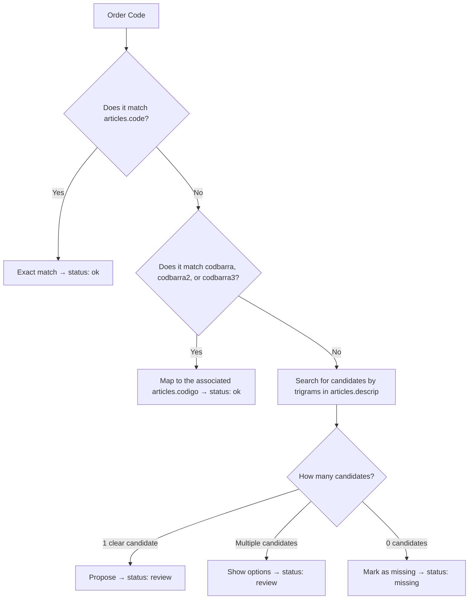

# Product Catalog — Parity

> The structure of the product catalog that Parity uses for order matching. It defines the fields, the matching flow, and the rules that govern it.

## Catalog Structure (`articles` table)

| Field | Type | Description | Role in matching |
| --- | --- | --- | --- |
| `code` | PK (string) | **Internal company code** — the single source of truth | Primary exact match |
| `supplier_code` | string | Supplier code | Reference, not used in matching |
| `descrip` | string | Product description | Approximate match (trigrams) |
| `linea` | string | Product line or category | Filter, no direct matching |
| `codbarra` | string | Primary barcode (EAN-13) | Alternative match → maps to `codigo` |
| `barcode2` | string | Secondary barcode | Alternative match → maps to `code` |
| `barcode3` | string | Tertiary barcode | Alternative match → maps to `code` |

### Important Notes

- **Two different items may share the same EAN** (change in packaging → same barcode, different `codigo`). The system prioritizes the match based on the internal `codigo`.
- **The `codigo` is what matters to the company.** The barcode is just an alternative way to arrive at the correct `codigo`.

## Matching Workflow

When an order arrives with a code in the `item_code/combo` column, the system executes this workflow:

### Matching Rules

| ID | Rule | Source |
| --- | --- | --- |
| RB-001 | The internal code (`codigo`) is the definitive source. If the order contains a barcode, it is mapped to the associated `codigo`; the barcode is not used as the final identifier | User |
| RB-002 | `ok` only if identical: the order code must be exactly the same as `code` in the database. Any variation goes to `review` | ADR-010 |
| RB-003 | Matching by LLM always starts in `review`. The system never auto-approves a line matched by LLM | ADR-009 |
| RB-005 | Ambiguity is detected; it is not resolved automatically. The system displays candidates for the employee to choose from | `domain-model.md` |

### Resulting Line Statuses

| Status | Meaning | When it occurs |
| --- | --- | --- |
| `ok` | Match confirmed, identical to the catalog | Exact code or barcode mapped with 100% certainty |
| `review` | Requires human review | Multiple candidates, LLM match, or approximate match |
| `error` | Error in line data | Malformatted code, incomplete data |
| `missing` | Item not found in the catalog | 0 candidates after the search |

## Search Indexes (PostgreSQL)

| Index | Field(s) | Purpose |
| --- | --- | --- |
| B-tree | `articles(code)` | Exact match by internal code |
| B-tree | `articles(barcode)`, `(barcode2)`, `(barcode3)` | Match by barcode |
| GIN + pg_trgm | `articles(descrip)` | Approximate search by text similarity |

> Required extension: `pg_trgm` for trigrams. See `data-model.md`.

## Idempotent Import

- The catalog is imported by `code`: if a `code` already exists, it is updated; if it is new, it is inserted.
- This allows prices, descriptions, or barcodes to be updated without duplicating items.
- Importing is an admin operation, not automatic.

## Data Restrictions

- **Do not use the actual `lista_articulos.xlsx` file** in testing or development. Use only synthetic fixtures in `testdata/` that mimic the structure without the actual data.
- **Separate test database** from production. Never test against the live database.
