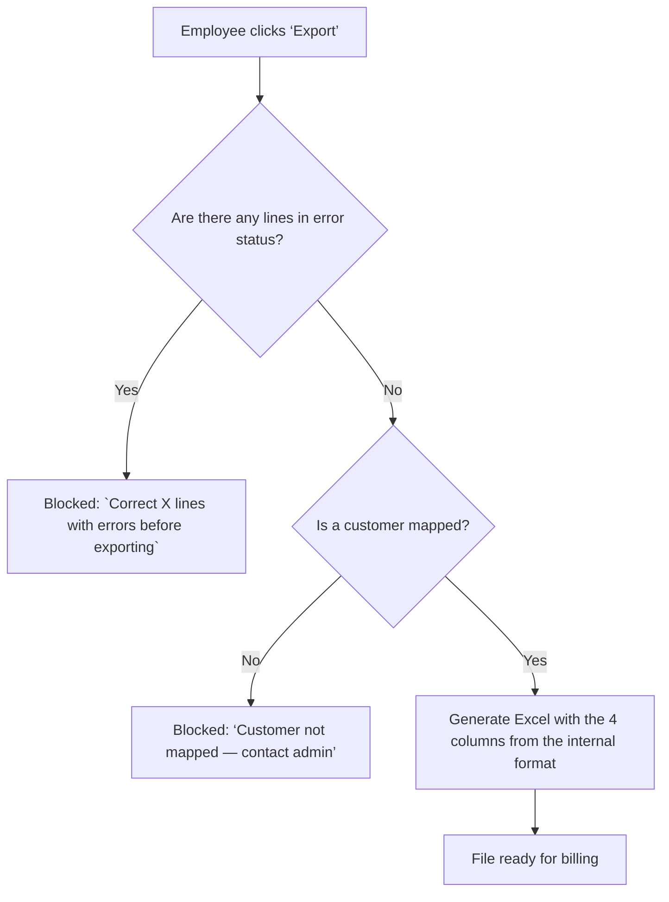

# Purchase Order — Parity

> A document that describes how an order reaches Parity, what the employee sees when processing it on the dashboard, and what rules apply when exporting. This is not a technical parsing specification—it is the definitive source for the order flow.

## 1. Input Formats

Parity accepts orders in **any format** the customer submits. The system normalizes everything into a standard internal structure.

| Channel / Format | How it arrives | What Parity extracts | MVP Status |
| --- | --- | --- | --- |
| **Excel (.xlsx)** | Attachment, drag & drop | Customer data, products, and quantities from the file’s columns | ✅ Supported |
| **PDF with tables** | Attachment | Extraction via library + LLM + reconciler; all rows from the LLM source are placed in `review` | ✅ Supported |
| **Text-based PDF** | Attachment | Extraction via library (standard workflow) | ✅ Supported |
| **Free-form text** (email, WhatsApp) | Copy-paste or text upload | Interpretation via LLM | ⏸️ Stretch (F5) |
| **WhatsApp photo** | Attached image | OCR | ❌ Out of scope (F9) — request a legible resend |

> The input format is **heterogeneous** — customers send orders however they want. Parity is the bridge that standardizes that information.

## 2. What the Employee Sees on the Dashboard

After Parity processes the order, the employee sees an **Excel-style grid** showing each line item in the order and its status.

### Line Item Statuses

| Status | Color | What It Means | What the Employee Can Do |
| --- | --- | --- | --- |
| `ok` | Green | Match confirmed, identical to the catalog, no changes needed | Review and proceed to export |
| `review` | Amber | Requires human review (multiple candidates, LLM match, or approximate match) | Choose a candidate, edit, or confirm |
| `error` | Red | Data present but invalid (non-existent code, empty quantity, EAN not found) | Correct or delete the line |
| `missing` | Gray | Item not found in the catalog (0 candidates) | Add manually or delete |

### What the employee sees in each row

| Grid column | What it shows | Editable |
| --- | --- | --- |
| Customer code | Resolved customer code (or “unmapped” in amber badge) | Yes (the employee can verify and correct—they have their own Excel file with their customers) |
| Item Code | Internal catalog code | Yes (dropdown with search function) |
| Description | Product description from the catalog | Yes (if changed, the code is recalculated) |
| Supplier | Item supplier | No |
| Boxes | Number of boxes | Yes |
| Units | Number of units | Yes |
| Status | Color badge (`ok` / `review` / `error` / `missing`) | No (recalculated after editing) |
| Match source | How it was matched: `exact`, `slash`, `manual`, |  |

### Visible Alerts

| Alert | When it appears | What to do |
| --- | --- | --- |
| **“Unmapped customer”** (amber badge) | The order's CUIT/business name does not have a `codigo_cliente` in `client_mappings` | The admin creates the mapping (export prerequisite) |
| **“Review: X candidates”** (amber) | The description matches multiple products in the catalog | Select the correct candidate from the dropdown |
| **“Error: non-existent code”** (red) | The order code does not match any `codigo` or `codbarra` in the catalog | Correct the code or delete the row |
| **“Export blocked”** (global red) | There is at least one row with an `error` status | Correct all `errors` before exporting |

### Employee Actions on the Grid

| Action | How | Result |
| --- | --- | --- |
| **Edit cell** | Click directly on the cell | Changes the value and revalidates |
| **Change product** | Dropdown with search function in the “Description” column | If another product is selected, the code is recalculated and the status is revalidated |
| **Add row** | “+” button at the bottom of the grid | Adds an empty row for manual entry |
| **Delete row** | “×” button in the row | Removes the row (with audit trail) |
| **Select Candidate** | Click the “review” badge → dropdown menu of options | Confirm the correct product |

## 3. Export

### Output Format

The exported Excel file is formatted to meet the requirements of the distributor’s **internal billing system**. It is the same format that employees currently create manually in Excel—Parity generates it automatically.

The export is generated via `GET /api/v1/orders/:id/export.xlsx`.

### Structure of the Exported Excel File

| Column | Description |
| --- | --- |
| `customer_code` | Internal customer code (resolved and verified) |
| `item_code/combo` | Internal catalog code (resolved) |
| `boxes` | Confirmed number of boxes |
| `units` | Confirmed number of units |

**Formatting Rules:**

- **Row 1 = headers.** Data begins in **row 2**.
- If `boxes` or `units` does not apply, it must be `0`.
- This is the format the billing system expects to receive.

### Export Rules

| ID | Rule | Source |
| --- | --- | --- |
| RB-004 | **Never auto-invoice.** Export is explicit (1 click), never automatic | `domain-model.md` |
| RB-006 | **If no customer is mapped, do not export.** If the `customer_code` is missing, the order is blocked | `domain-model.md` |
| RB-009 | **Blocking error; review required.** If any row is marked as `error`, exporting is not allowed. Lines in `review` are exported but flagged | `api-design.md` |
| — | **Traceability.** Each exported row stores a log of how it was matched (`exact`, `slash`, `manual`, `llm`) | `domain-model.md` |

### Export Flow

## 4. Data Restrictions

- **Do not use the actual `lista_articulos.xlsx`** in testing or development. Use only synthetic fixtures in `testdata/` that mimic the structure without the actual data.
- **Separate test database** from production. Never test against the actual database.
