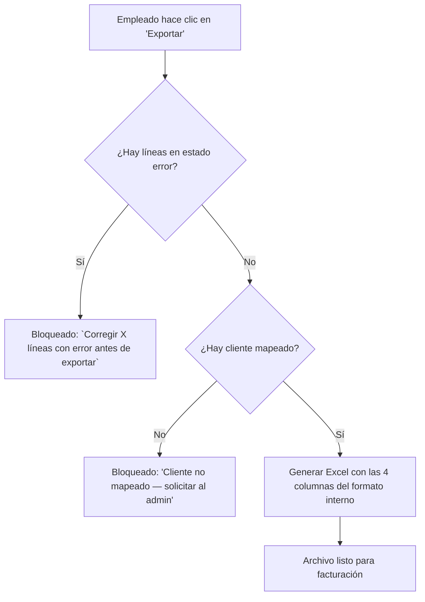

# Orden de Compra — Parity

> Documento que describe cómo llega una orden a Parity, qué ve el empleado cuando la procesa en el dashboard, y qué reglas aplican al momento de exportar. No es una spec técnica de parsing — es la fuente de verdad del flujo de órdenes.

## 1. Formatos de entrada

Parity recibe órdenes en **cualquier formato** que el cliente envíe. El sistema normaliza todo a una estructura interna estándar.

| Canal / Formato | Cómo llega | Qué extrae Parity | Estado MVP |
| --- | --- | --- | --- |
| **Excel (.xlsx)** | Archivo adjunto, drag&drop | Datos del cliente, productos y cantidades de las columnas del archivo | ✅ Soportado |
| **PDF con tablas** | Archivo adjunto | Extracción vía librería + LLM + reconciliador; todas las filas de origen LLM nacen en `revisar` | ✅ Soportado |
| **PDF de texto** | Archivo adjunto | Extracción por librería (flujo estándar) | ✅ Soportado |
| **Texto libre** (mail, WhatsApp) | Copy-paste o upload de texto | Interpretación vía LLM | ⏸️ Stretch (F5) |
| **Foto de WhatsApp** | Imagen adjunta | OCR | ❌ Fuera (F9) — pedir reenvío legible |

> El formato de entrada es **heterogéneo** — los clientes envían órdenes como quieren. Parity es el puente que estandariza esa información.

## 2. Qué ve el empleado en el dashboard

Después de que Parity procesa la orden, el empleado ve una **grilla tipo Excel** con cada línea de la orden y su estado.

### Estados de línea

| Estado | Color | Qué significa | Qué puede hacer el empleado |
| --- | --- | --- | --- |
| `ok` | Verde | Match confirmado, idéntico al catálogo, sin tocar nada | Revisar y pasar a exportar |
| `revisar` | Ámbar | Requiere revisión humana (múltiples candidatos, match por LLM, o match aproximado) | Elegir candidato, editar, o confirmar |
| `error` | Rojo | Dato presente pero inválido (código inexistente, cantidad vacía, EAN no encontrado) | Corregir o eliminar la línea |
| `faltante` | Gris | Artículo no encontrado en el catálogo (0 candidatos) | Agregar manualmente o eliminar |

### Qué ve el empleado en cada fila

| Columna de la grilla | Qué muestra | Editable |
| --- | --- | --- |
| Código cliente | Código resuelto del cliente (o "no mapeado" en badge ámbar) | Sí (el empleado puede verificar y corregir — ellos tienen su excel con sus clientes) |
| Código artículo | Código interno del catálogo | Sí (dropdown con buscador) |
| Descripción | Descripción del producto del catálogo | Sí (si cambia, se recalcula el código) |
| Proveedor | Proveedor del artículo | No |
| Cajas | Cantidad de cajas | Sí |
| Unidades | Cantidad de unidades | Sí |
| Estado | Badge de color (`ok` / `revisar` / `error` / `faltante`) | No (se recalcula tras editar) |
| Origen del match | Cómo se matcheó: `exacto`, `barra`, `manual`, `llm` | No |

### Alertas visibles

| Alerta | Cuándo aparece | Qué hacer |
| --- | --- | --- |
| **"Cliente no mapeado"** (badge ámbar) | El CUIT/razón social de la orden no tiene `codigo_cliente` en `client_mappings` | El admin crea el mapeo (prerrequisito de exportación) |
| **"Revisar: X candidatos"** (ámbar) | La descripción matchea con múltiples productos del catálogo | Elegir el candidato correcto del dropdown |
| **"Error: código inexistente"** (rojo) | El código de la orden no coincide con ningún `codigo` ni `codbarra` del catálogo | Corregir el código o eliminar la línea |
| **"Exportación bloqueada"** (rojo global) | Hay al menos una línea con estado `error` | Corregir todos los `error` antes de exportar |

### Acciones del empleado sobre la grilla

| Acción | Cómo | Resultado |
| --- | --- | --- |
| **Editar celda** | Click directo en la celda | Cambia el valor y revalida |
| **Cambiar producto** | Dropdown con buscador en la columna "Descripción" | Si elige otro producto, se recalcula el código y se revalida el estado |
| **Agregar línea** | Botón "+" al final de la grilla | Agrega fila vacía para cargar manualmente |
| **Eliminar línea** | Botón "×" en la fila | Quita la línea (con log de auditoría) |
| **Elegir candidato** | Click en el badge "revisar" → dropdown de alternativas | Confirma cuál es el producto correcto |

## 3. Exportación

### Formato de salida

El Excel exportado tiene el formato que el **sistema interno de facturación** de la distribuidora necesita. Es el mismo formato que hoy el empleado arma manualmente en Excel — Parity lo genera automáticamente.

La exportación se genera vía `GET /api/v1/orders/:id/export.xlsx`.

### Estructura del Excel exportado

| Columna | Descripción |
| --- | --- |
| `codigo_cliente` | Código interno del cliente (resuelto y verificado) |
| `codigo_articulo/combo` | Código interno del catálogo (resuelto) |
| `cajas` | Cantidad de cajas confirmada |
| `unidades` | Cantidad de unidades confirmada |

**Reglas del formato:**

- **Fila 1 = títulos.** Los datos comienzan desde la **fila 2**.
- Si `cajas` o `unidades` no aplica, debe ser `0`.
- Este formato es el que el sistema de facturación espera recibir.

### Reglas de exportación

| ID | Regla | Fuente |
| --- | --- | --- |
| RB-004 | **Nunca auto-facturar.** La exportación es explícita (1 clic), nunca automática | `domain-model.md` |
| RB-006 | **Sin cliente mapeado no se exporta.** Si falta el `codigo_cliente`, la orden se bloquea | `domain-model.md` |
| RB-009 | **Error bloquea, revisar no.** Si hay alguna línea en `error`, la exportación no se permite. Las líneas en `revisar` se exportan pero se advierten | `api-design.md` |
| — | **Trazabilidad.** Cada fila exportada guarda el log de cómo se matcheó (`exacto`, `barra`, `manual`, `llm`) | `domain-model.md` |

### Flujo de exportación

## 4. Restricciones de datos

- **Prohibido usar `lista_articulos.xlsx` real** en pruebas o desarrollo. Solo fixtures sintéticos en `testdata/` que imiten la forma sin sus datos.
- **DB de prueba separada** de producción. Nunca testear contra la BD real.
